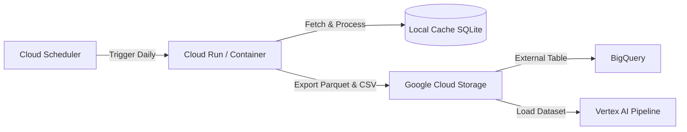

# Deployment & Operations

[🏠 Home](../README.md) • [📖 Overview](README.md) • [🏗️ Architecture](architecture.md) • [💻 Setup](installation_usage.md) • [🔌 API & Cache](api_cache.md) • [📊 Processing & Optimization](analysis_optimization.md) • [🚀 Deployment](deployment.md)

---

This document outlines directory structures, output layouts, deployment strategies, and integration patterns with Google Cloud Platform (GCP) and downstream Machine Learning pipelines.

---

## 1. Directory Structure & Outputs Map

CDG saves all executed pipeline data and charts into standard, timestamped directories under the configured base output directory (defaults to `cdg_files/`):

### A. Run Directory (Pipeline Output)
Created whenever `run-pipeline` executes:
`{output_dir}/run_YYYYMMDD_HHMMSS/`

- `data.csv`: Aligned dataset including raw prices, volume, calculated indicators, and scaled ML features.
- `data.parquet`: Apache Parquet column-oriented format (standardized for rapid Python, Pandas, and BigQuery imports).
- `portfolio_weights.csv`: Contains the optimal allocation weights for both the Max Sharpe Ratio and Minimum Volatility portfolios.
- `efficient_frontier.png`: Scatter plot visualization of all simulated portfolio points.
- `performance.png`: Line chart displaying cumulative asset growth/performance normalized to 100%.
- `risk_return.png`: Scatter plot mapping expected returns against volatility risk.
- `{coin}_{currency}_returns.png`: Daily returns line charts for each specific asset pair.
- `raw_ohlcv/`: Directory containing raw OHLCV files (saved in the configured raw format: `.json` or `.csv`):
  - `{coin}_{currency}.csv` (if CSV format is selected)
  - `{coin}_{currency}.json` (if JSON format is selected)

### B. Standalone Raw Candlestick Directory
Created when executing standalone raw candlestick (`ohlcv`) data exports:
`{output_dir}/can_YYYYMMDD_HHMMSS/`

- `{coin}_{currency}.csv` (if CSV format is selected)
- `{coin}_{currency}.json` (if JSON format is selected)

---

## 2. Docker Containerization

For consistent cloud deployments, CDG can be containerized using a standard multi-stage Dockerfile. This keeps the production container extremely small (less than 50MB):

```dockerfile
# --- Stage 1: Build ---
FROM rust:1.75-slim AS builder
WORKDIR /app
COPY . .
RUN apt-get update && apt-get install -y sqlite3 libsqlite3-dev pkg-config && rm -rf /var/lib/apt/lists/*
RUN cargo build --release

# --- Stage 2: Production ---
FROM debian:bookworm-slim
WORKDIR /app
RUN apt-get update && apt-get install -y ca-certificates sqlite3 libsqlite3-0 && rm -rf /var/lib/apt/lists/*
COPY --from=builder /app/target/release/cdg /usr/local/bin/cdg
ENTRYPOINT ["cdg"]
```

---

## 3. GCP Integration Architecture

CDG is fully optimized to run within Google Cloud environments with minimal operational overhead and zero licensing costs:



### A. Serverless Execution (Cloud Run / Cloud Run Jobs)
- **Execution**: Trigger CDG inside a container daily via **Cloud Scheduler** using a POST request.
- **Resource Footprint**: The application runs efficiently under `--light` mode, keeping memory usage strictly under 100MB to fit within the GCP Free Tier.

### B. Storage & Analytical Integrations (BigQuery & GCS)
- **Data Lakeing**: Exported `.parquet` files can be synchronized directly to a **Google Cloud Storage (GCS)** bucket.
- **BigQuery Federated Queries**: Set up a BigQuery external table pointing to your GCS Parquet path to query processed indicators using SQL without incurring DB storage fees.
- **Vertex AI Model Training**: Downstream Vertex AI training pipelines can pull pre-processed scaled feature columns directly from GCS Parquet files.
